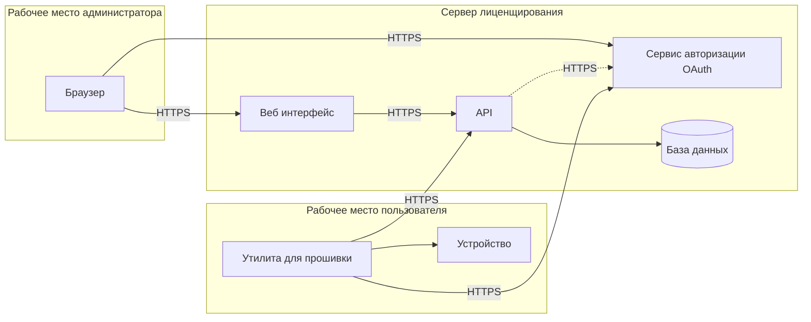

# Структура и диаграмы

## Структура

```mermaid
flowchart LR
    subgraph admin_pc["Рабочее место администратора"]
        browser["Браузер"]
    end
    subgraph user_pc["Рабочее место пользователя"]
        util["Утилита для прошивки"]
        device["Устройство"]
    end
    subgraph license_server["Сервер лиценщирования"]
        identity_service["Сервис авторизации OAuth"]
        web["Веб интерфейс"]
        database[("База данных")]
        api["API"]
        
    end
    
    browser -->|HTTPS| web
    browser -->|HTTPS| identity_service
    web -->|HTTPS| api
    api --> database
    api -.->|HTTPS| identity_service
    util -->|HTTPS| identity_service
    util -->|HTTPS| api
    util --> device
```