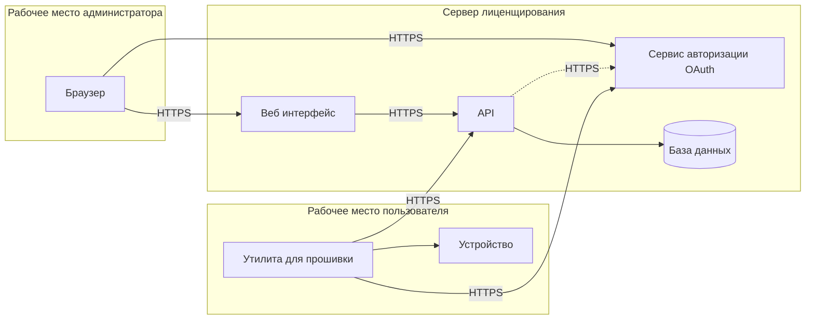
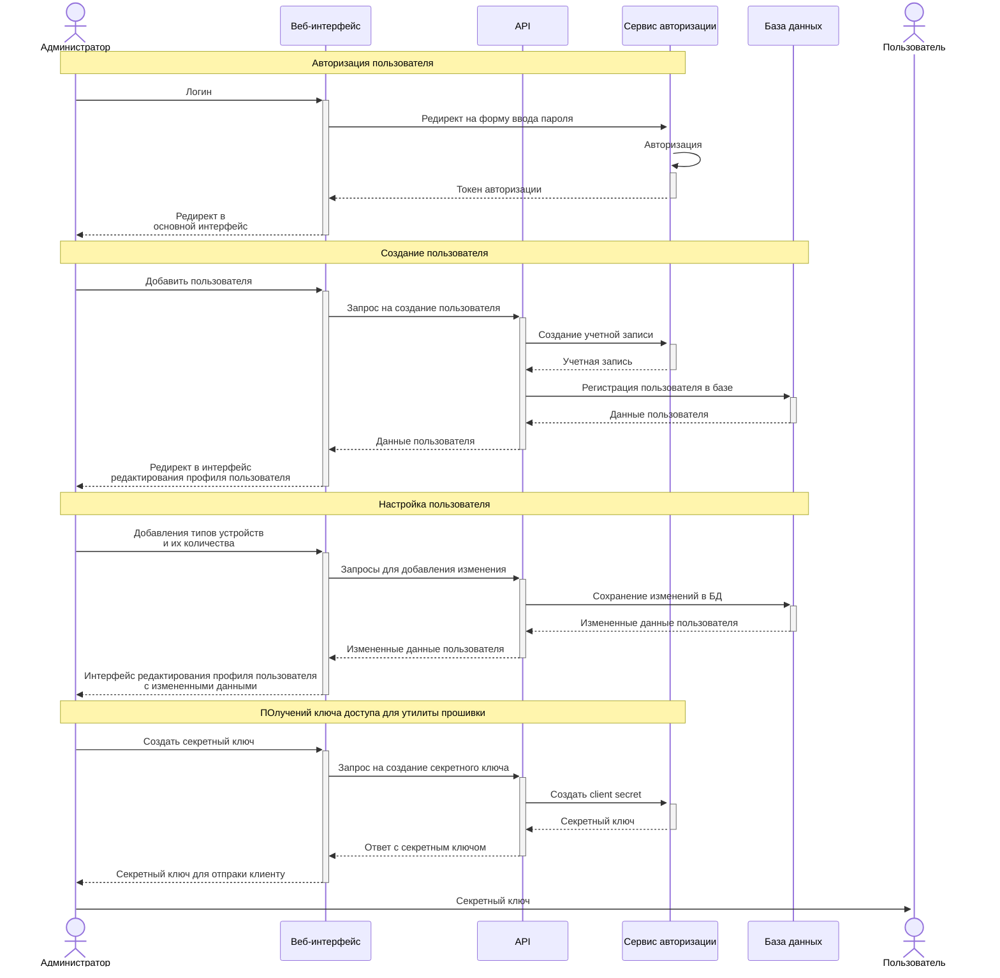
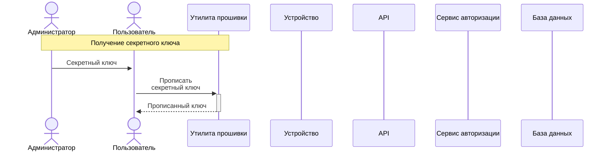

# Структура и диаграмы

## Структура

```mermaid
flowchart LR
    subgraph admin_pc["Рабочее место администратора"]
        browser["Браузер"]
    end
    subgraph user_pc["Рабочее место пользователя"]
        util["Утилита для прошивки"]
        device["Устройство"]
    end
    subgraph license_server["Сервер лиценщирования"]
        identity_service["Сервис авторизации OAuth"]
        web["Веб интерфейс"]
        database[("База данных")]
        api["API"]
        
    end
    
    browser -->|HTTPS| web
    browser -->|HTTPS| identity_service
    web -->|HTTPS| api
    api --> database
    api -.->|HTTPS| identity_service
    util -->|HTTPS| identity_service
    util -->|HTTPS| api
    util --> device
```

## Диаграмма процесса настройки

```mermaid
sequenceDiagram
    actor Admin as Администратор
    participant Web as Веб-интерфейс
    participant Api as API
    participant Identity as Сервис авторизации
    participant Database as База данных
    actor User as Пользователь
    
    note over Admin, Identity: Авторизация пользователя
    
    Admin ->>+ Web: Логин
    Web ->>+ Identity: Редирект на форму ввода пароля
    Identity ->>+ Identity: Авторизация
    Identity -->>- Web: Токен авторизации
    Web -->>- Admin: Редирект в <br/> основной интерфейс
    
    note over Admin, Database: Создание пользователя
    
    Admin ->>+ Web: Добавить пользователя
    Web ->>+ Api: Запрос на создание пользователя
    Api ->>+ Identity: Создание учетной записи
    Identity -->>- Api: Учетная запись
    Api ->>+ Database: Регистрация пользователя в базе
    Database -->>- Api: Данные пользователя
    Api -->>- Web: Данные пользователя
    Web -->>- Admin: Редирект в интерфейс<br/> редактирования профиля пользователя
    
    note over Admin, Database: Настройка пользователя
    
    Admin ->>+ Web: Добавления типов устройств<br/>и их количества
    Web ->>+ Api: Запросы для добавления изменения
    Api ->>+ Database: Сохранение изменений в БД
    Database -->>- Api: Измененные данные пользователя
    Api -->>- Web: Измененные данные пользователя
    Web -->>- Admin: Интерфейс редактирования профиля пользователя <br/> с измененными данными
    
    note over Admin, Identity: ПОлучений ключа доступа для утилиты прошивки
    
    Admin ->>+ Web: Создать секретный ключ
    Web ->>+ Api: Запрос на создание секретного ключа
    Api ->>+ Identity: Создать client secret
    Identity -->>- Api: Секретный ключ
    Api -->>- Web: Ответ с секретным ключом
    Web -->>- Admin: Секретный ключ для отпраки клиенту
    Admin ->>+ User: Секретный ключ
```

## Диаграмма прошивки устройства

```mermaid
sequenceDiagram
    actor Admin as Администратор
    actor User as Пользователь
    participant Utility as Утилита прошивки
    participant Device as Устройство
    participant Api as API
    participant Identity as Сервис авторизации
    participant Database as База данных
    
    note over Admin, Utility: Получение секретного ключа
    
    Admin ->>+ User: Секретный ключ
    User ->>+ Utility: Прописать<br/>секретный ключ
    Utility -->>- User: Прописанный ключ
```